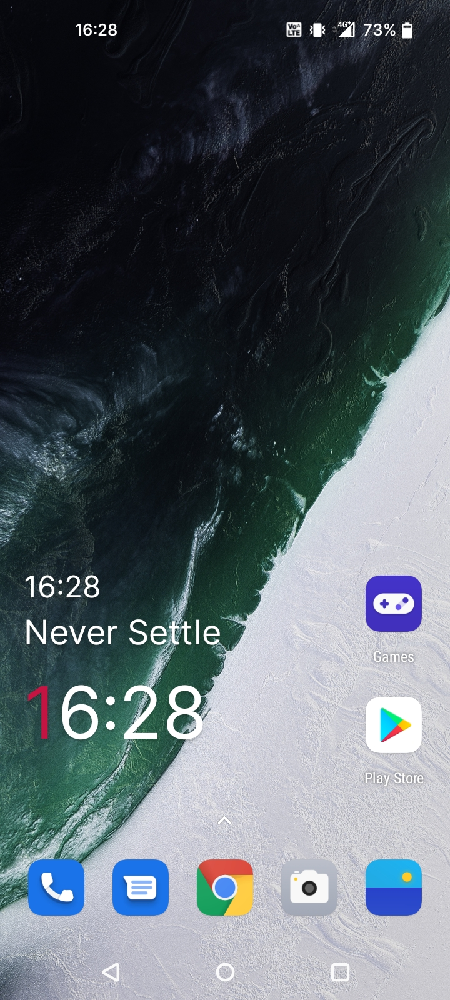
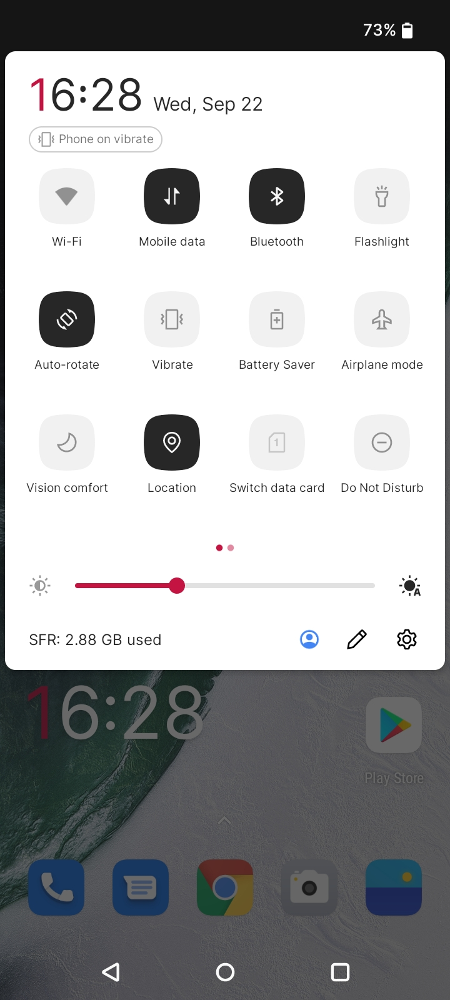
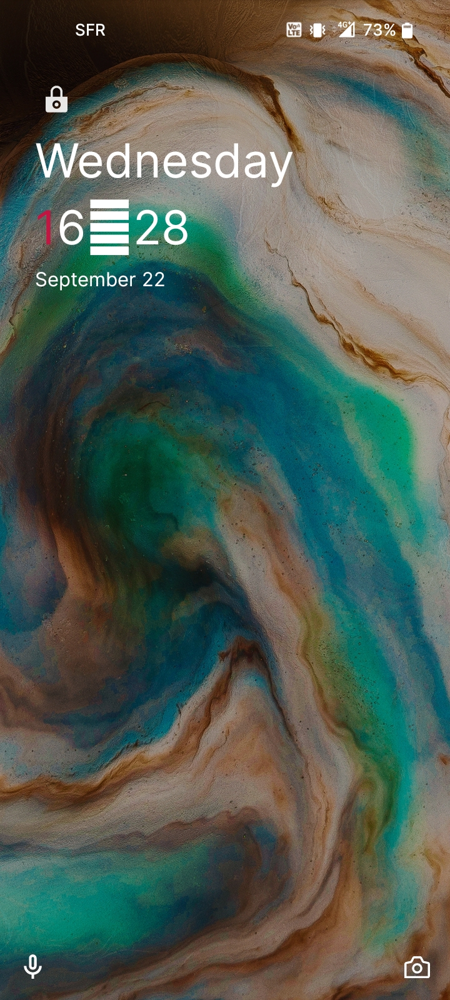

# Inter Font Pack for OnePlus devices

This is a Magisk module that replaces Oxygen OS's system fonts with:

- [Inter](https://github.com/rsms/inter) for most text
- [Fira Code](https://github.com/tonsky/FiraCode) for monospace text
- [Source Serif](https://github.com/adobe-fonts/source-serif) for serif text

Inter was chosen as the UI font for its cleanliness and legibility; it is neutral and looks similar to Apple's San Francisco UI font. Because it was specifically designed for use in GUIs, it is a great replacement for Roboto on Android.

Source Serif was chosen as the serif font because it is one of the best open-source fonts that complement Inter's style.

All fonts included in this module are open-source and licensed under the SIL Open Font License.

## Why this port ?

Initially, I had installed the original module by [kdrag0n](https://github.com/kdrag0n), then I realized that the font was not applyied everywhere, like on the quick settings clock or on the home screen widget. I looked inside some system apks and found that most of the OnePlus apps had the OnePlus sans embeded in their resources, so I decided to create this fork to fix these issues.

## What does this port change ?

This fork adds overlays to OnePlus system apps and replace every OnePlus sans I have found in the system. It also hides the font setting in the theme section of system settings, since it is now useless, and also removes the Google Sans replacements that are unnecessary in Oxygen OS.

## Compatibility

Both Roboto and OnePlus Sans have been replaced with Inter for more consistent typography on the stock Oxygen OS ROM.

To maximize compatibility, all font names have been patched to match the original fonts. This fixes some issues in third-party apps, such Firefox falling back to Fira Sans instead of using the new fonts.

Additionally, Roboto will be used as a fallback for characters not supported by Inter. This is done by patching Roboto (which is included as a variable font to save space) to create a fallback variant and registering it as a proper fallback rather than modifying the Inter font itself. As a result, most text will be rendered with the original Inter font, and unsupported characters will still be displayed with proper metrics and hinting.

This module is supposed to work on the most recent Oxygen OS versions, although I only tested it on my OnePlus Nord N100 (EU) running Oxygen OS 11.0.1.

## Preview

||||
|:-:|:-:|:-:|
|Home screen|Quick settings|Lock screen (the weird rectangle is now fixed)|

## Installation

For the two methods, do not forget to set the font to Roboto in settings before flashing the module to avoid UI bugs.

#### From releases

Download the latest version zip from the releases page and flash it via Magisk.

#### Manual Installation

Requirements:
 - Android SDK installed and adb in the path.
 - One JDK installed and JAVA_HOME environment variable set.
 - GNU Make installed.

From your computer, clone this repository then run one of these commands:
 - `make` to build overlays and push them in the module source, then build the module.
 - `make overlays` to build overlays and push them in the module source.
 - `make magisk` to only build the module.
 - `make install` to build then install the module on your phone.

## License

This module is licensed under the [MIT License](LICENSE).
